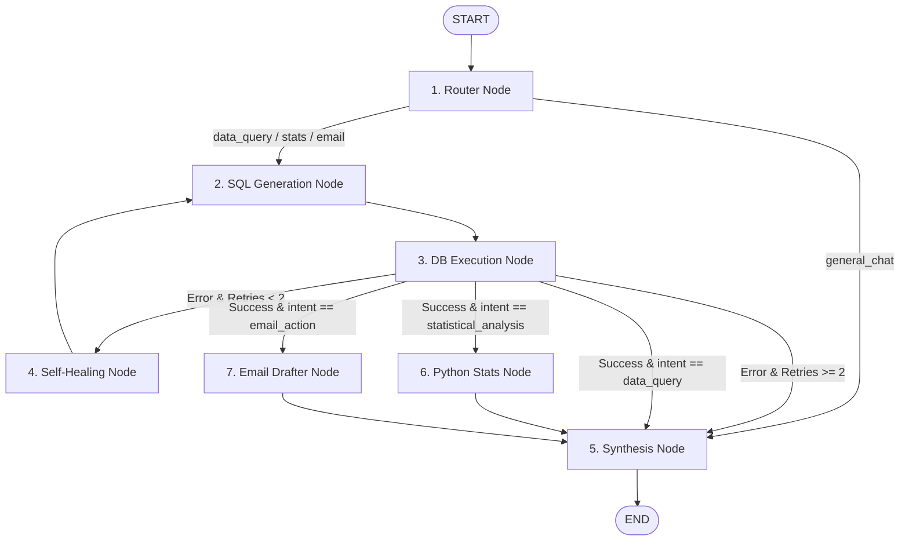

# 📋 Spec 02: LangGraph State Machine & Specialized Nodes

> **Module 02 of DataPilot Architecture**  
> *Scope: LangGraph cyclic state graph, conditional routing, self-healing SQL execution loop, stats node, email action node, and synthesis node (excluding ingest_node).*

---

## 🎯 1. Objective & Scope

Construct the agentic state machine for DataPilot using **LangGraph**:
1. **Dependency Installation**: Add `langgraph` via `uv add langgraph`.
2. **Specialized Graph Nodes (`backend/app/agents/nodes/`)**:
   - `router_node.py`: Classifies user inquiry into `data_query`, `statistical_analysis`, `email_action`, or `general_chat`, logging real-time thought traces.
   - `sql_node.py`: Generates read-only PostgreSQL queries with schema context.
   - `heal_node.py`: Diagnoses execution errors and rewrites queries for up to 2 self-healing retries.
   - `stats_node.py`: Executes Python statistical calculations (`profit_margin`, `mom_growth`, `churn_rate`, `inventory_burn_rate`) on DB results.
   - `email_node.py`: Drafts structured VIP win-back, supplier PO, or payment reminder campaigns with Human-in-the-Loop approval flags.
   - `synthesis_node.py`: Synthesizes executive summaries in INR (₹) and determines visual `chart_config`.
3. **Graph Assembly (`backend/app/agents/graph.py`)**:
   - Assembles nodes with conditional routing edges.
   - Implements self-healing cycle (`sql_node ➔ execute ➔ heal_node ➔ sql_node`).
   - Compiles and exposes the executable workflow.

---

## 🏗️ 2. State Machine Flow Diagram



---

## 🧱 3. File Directory Map

```text
backend/app/agents/
├── __init__.py               # Exports compile_agent_graph, run_agent_workflow
├── state.py                  # AgentState TypedDict definition
├── graph.py                  # StateGraph construction, conditional edges & compilation
└── nodes/
    ├── __init__.py           # Exports all node functions
    ├── router_node.py        # Intent classification & thought trace logging
    ├── sql_node.py           # Text-to-SQL generation & database execution
    ├── heal_node.py          # Query debugger & self-healing retry logic
    ├── stats_node.py         # Advanced business mathematics & metrics calculation
    ├── email_node.py         # Action engine: Human-in-the-loop campaign drafter
    └── synthesis_node.py     # Executive summary writer & chart config generator
```

---

## 🧩 4. Node Specifications

### 4.1. `router_node.py`
* **Input**: `AgentState` (`user_question`, `messages`)
* **Logic**:
  - Prompts Gemini Flash to classify intent into:
    - `"data_query"` (standard SQL lookups, filtering, aggregations)
    - `"statistical_analysis"` (growth trends, profit margins, churn rates, inventory calculations)
    - `"email_action"` (win-back campaigns, supplier reorders, payment reminders)
    - `"general_chat"` (greetings, identity, general help)
  - Resets turn-specific state (`retry_count=0`, `error_history=[]`).
  - Appends to `agent_thought_trace`: `["🔍 [Router] Intent classified as <intent>"]`.
* **Output**: Updated `AgentState` fields: `intent`, `thought_process`, `direct_response`, `agent_thought_trace`.

### 4.2. `sql_node.py`
* **Input**: `AgentState` (`user_question`, `intent`, `sql_query`, `error_history`)
* **Logic**:
  - Fetches cached schema via `get_schema_context()`.
  - Generates PostgreSQL query.
  - Executes query via `execute_db_query(sql)`.
  - If execution fails, stores exception in `error_history` and sets `query_results=None`.
  - If execution succeeds, sets `query_results`, `columns`, `row_count`, `execution_time_ms`.
  - Appends to `agent_thought_trace`: `["⚡ [DB Execution] Query executed in <ms>ms (<rows> rows returned)"]`.
* **Output**: Updated `AgentState` fields: `sql_query`, `tables_used`, `query_results`, `columns`, `row_count`, `execution_time_ms`, `error_history`, `agent_thought_trace`.

### 4.3. `heal_node.py`
* **Input**: `AgentState` (`user_question`, `sql_query`, `error_history`, `retry_count`)
* **Logic**:
  - Prompts Gemini debugger with the failed SQL, database error, and schema.
  - Rewrites the corrected SQL query.
  - Increments `retry_count += 1`.
  - Appends to `agent_thought_trace`: `["🩹 [Self-Healing] Correcting SQL error (Attempt <retry_count>/2)"]`.
* **Output**: Updated `AgentState` fields: `sql_query`, `retry_count`, `agent_thought_trace`.

### 4.4. `stats_node.py`
* **Input**: `AgentState` (`user_question`, `query_results`, `intent`)
* **Logic**:
  - Detects relevant metric from user question (`profit_margin`, `mom_growth`, `churn_rate`, `inventory_burn_rate`).
  - Executes sandboxed calculation via `execute_python_stats`.
  - Appends to `agent_thought_trace`: `["🧮 [Stats Engine] Computed <metric> across dataset"]`.
* **Output**: Updated `AgentState` fields: `computed_metrics`, `agent_thought_trace`.

### 4.5. `email_node.py`
* **Input**: `AgentState` (`user_question`, `query_results`, `intent`)
* **Logic**:
  - Generates structured draft campaign payload via `draft_email_action`.
  - Extracts recipient count and sample rows.
  - Enforces `requires_human_approval = True`.
  - Appends to `agent_thought_trace`: `["✉️ [Action Engine] Generated draft campaign payload for human review"]`.
* **Output**: Updated `AgentState` fields: `action_type`, `action_payload`, `requires_human_approval`, `agent_thought_trace`.

### 4.6. `synthesis_node.py`
* **Input**: `AgentState` (all context fields)
* **Logic**:
  - If `intent == "general_chat"`, returns `direct_response`.
  - If data exists, generates executive natural language summary in INR (₹) with bold metrics.
  - Integrates `computed_metrics` or `action_payload` summary if present.
  - Runs `determine_chart_config()` to detect if Bar, Line, Area, or Donut chart is appropriate.
  - Appends to `agent_thought_trace`: `["📊 [Synthesis] Generated executive insights and chart configuration"]`.
* **Output**: Updated `AgentState` fields: `final_response`, `chart_config`, `agent_thought_trace`.

---

## 🔀 5. Conditional Routing Logic (`graph.py`)

```python
def route_after_router(state: AgentState) -> str:
    if state["intent"] == "general_chat":
        return "synthesis_node"
    return "sql_node"

def route_after_sql(state: AgentState) -> str:
    # Error handling branch
    if state.get("query_results") is None:
        if state.get("retry_count", 0) < 2:
            return "heal_node"
        return "synthesis_node"
    
    # Feature branching
    intent = state.get("intent")
    if intent == "statistical_analysis":
        return "stats_node"
    elif intent == "email_action":
        return "email_node"
    return "synthesis_node"
```

---

## 🧪 6. Verification Criteria

1. `uv add langgraph` successfully resolves dependencies.
2. State machine compiles without graph cycles or orphaned nodes.
3. General chat questions route directly to synthesis without invoking SQL.
4. Data queries execute SQL and route to synthesis.
5. Failing SQL queries trigger self-healing (up to 2 retries) and recover.
6. Statistical questions trigger `stats_node` and populate `computed_metrics`.
7. Action/Email questions trigger `email_node` and set `requires_human_approval = True`.
8. Complete workflow execution returns rich `AgentState` with full thought traces.
